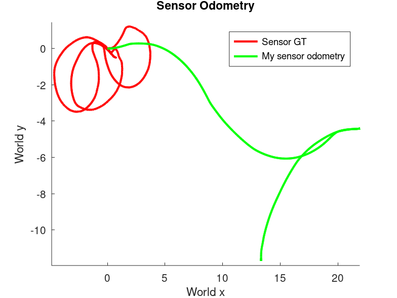
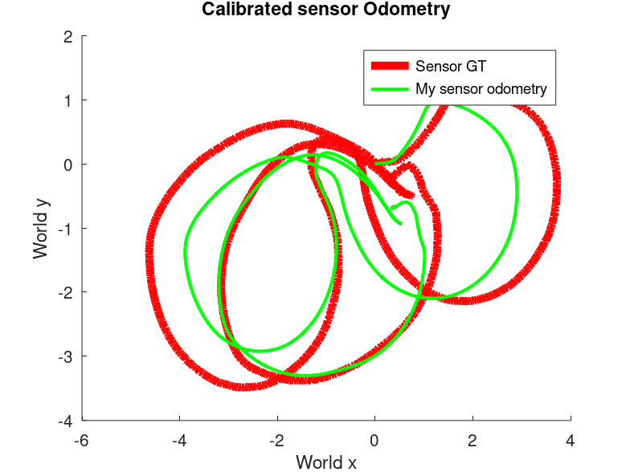
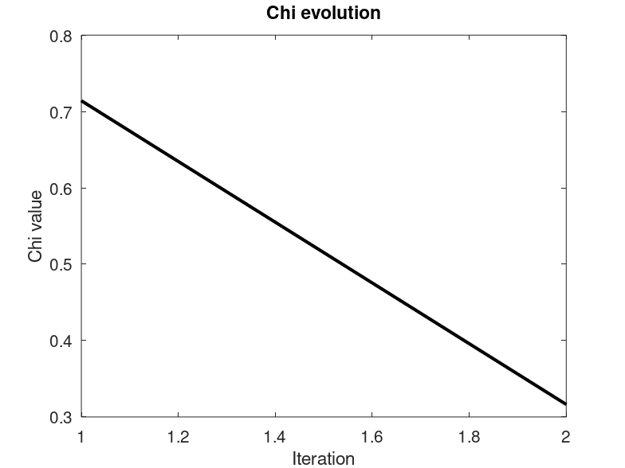
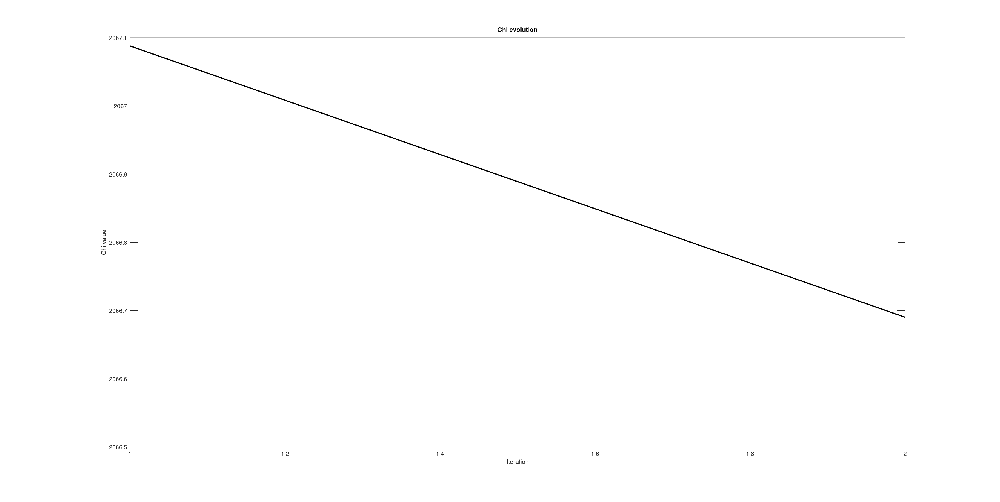
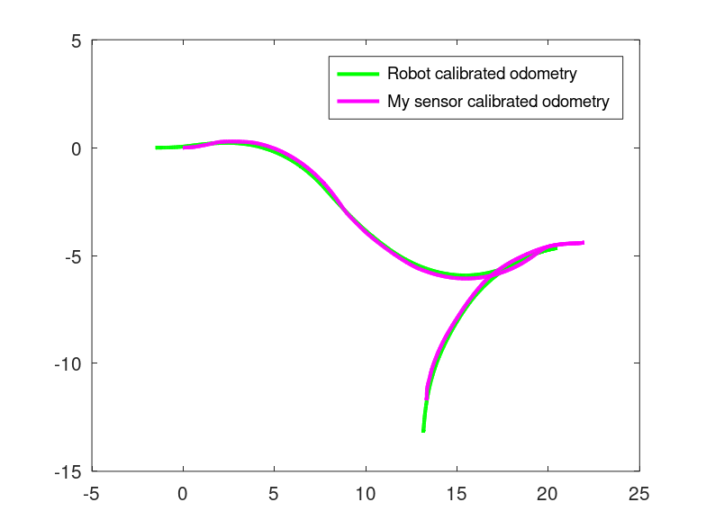

# Calibration of a (real) Robot

## Task Overview

The dataset contains data collected from the sensors of a **real mobile robot**. Namely, a **front-tractor tricycle**.

The **output** should be:

### 1. Sensor Position

- **2D position of the sensor** with respect to the **base link**

### 2. Kinematic Parameters

- **`ksteer`**: radians per tick (of the steering encoder)
- **`ktraction`**: meters per tick (of the traction encoder)
- **`steer_offset`**: steering angle corresponding to zero wheel position
- **`base_line`**: length of the baseline. **Remember that the kinematic center is in the middle of the axis of the rear wheels**

---

## Dataset File

### `dataset.txt`

The first 10 lines contain:

- **Kinematic model**: traction_drive_wheel (front-tractor tricycle)
- **Kinematic parameters to be estimated**
- **Initial guesses** for the parameters
- **Encoder order** 
- **Encoder maximum ranges**
- **Laser w.r.t. base link transform** 

> [!IMPORTANT]
>
> The encoder order and ranges are critical for correctly interpreting the encoder tick data.

---

## Data Record Structure

Each record in the dataset is composed of the following fields:

### 1. Time

- **`time`**: Timestamp of the measurement

### 2. Encoder Ticks

- **`ticks`**: Encoder readings
    - **Steering encoder**: absolute encoder
    - **Traction encoder**: incremental encoder

### 3. Model Pose

- **`model pose`**: Odometry computed using the kinematic model

> [!NOTE]
>
> This model **does not correspond** to the one used in AMR.
>
> You are free to define and use your own kinematic model for this task. Use this for validating your choice.

### 4. Tracker Pose

- **`tracker pose`**: Position of the sensor obtained from an external odometry/tracking system

---

## Encoder Data Notes

> [!WARNING]
>
> Encoder readings are stored as **`uint32`** values, so **overflow may occur** in some cases.

> [!TIP]
>
> Detect and avoid overflow cases.
>
> Use **incremental differences** between encoder readings when integrating the kinematic model.

---

## Methodology

### State

* Qualify the domain

$$
\boldsymbol{x}_r = \begin{pmatrix} k_s \\ k_t \\ so \\ b \end{pmatrix}^T \in \mathbb{R}^4, \quad
{^rX}_s = \begin{pmatrix} {^rR}_s|{^rt}_s \end{pmatrix} \in SE(2)
$$

Therefore:

$$
X = \\{ \boldsymbol{x}_r, {^rX}_s \\} \in \mathbb{R}^4 \times SE(2)
$$

* Define an Euclidean parametrization for the perturbation

$$
\Delta x = \begin{pmatrix} \Delta x_r  \\ \Delta x_s \end{pmatrix}^T \in \mathbb{R}^7
$$

Where:

$$
\Delta x_r = \begin{pmatrix}
\Delta k_s \\ \Delta k_t \\ \Delta so \\ \Delta b
\end{pmatrix}^T \in \mathbb{R}^4
$$

$$
\Delta {^rx}_s = \begin{pmatrix}
\Delta ^rx_s \\ \Delta ^ry_s \\ \Delta ^r\theta_s
\end{pmatrix}^T \in \mathbb{R}^3
$$

* Define $\boxplus$ operator

$$
{\vec{x}\prime}_r = \vec{x}_r + \Delta x_r \rightarrow{} \text{No } \boxplus \text{ because Euclidean}
$$

$$
{}^{r}{X\prime}_s = {}^{r}X_s \boxplus \Delta {}^{r}x_s = \text{v2t}(\Delta {}^{r}x_s) \cdot {}^{r}X_s
$$

### Controls

- Domain 

$$
\vec{u} = \begin{pmatrix} t_s \\ t_t \end{pmatrix}^T \in \mathbb{R}^2
$$

Where: 

- **Absolute encoder** $\rightarrow$ Steering ticks: $t_s$
- **Incremental encoder** $\rightarrow$ Traction ticks: $t_t$

### Measurements

* Qualify the domain

An external system provide the pose of the sensor in the world, namely

$$
{^w}Z_s = \begin{pmatrix} {^wR}_s | {^wt}_s\end{pmatrix} \in SE(2)
$$

However, out of these we will compute the relative motion of the sensor between pose $s$ and $s\prime$ . Therefore:

$$
^{s}Z_{s\prime} = \begin{pmatrix} {^sR}_{s\prime} | {^st}_{s\prime}\end{pmatrix} \in SE(2)
$$

* Define an Euclidean parametrization for the perturbation

$$
\Delta {^sz}_{s{\prime}} = \begin{pmatrix} \Delta ^sx_{s\prime} \\ \Delta^sy_{s\prime} \\ \Delta {^s}\theta_{s\prime} \end{pmatrix}^T \in \mathbb{R}^3
$$

* Define $\boxminus$ operator

$$
\Delta {^{s}z}_{s\prime}= {^{s}\bar{Z}}_{s\prime} \boxminus {^{s}Z}_{s\prime}=\text{t2v}\left[\left( {^{s}Z}_{s\prime} \right)^{-1} \cdot {^{s}\bar{Z}}_{s\prime}\right]
$$

* Identify prediction function

$$
h^{[s,s\prime]}(X) = {^sX}_r \cdot \text{v2t}\left(\Delta ^rx_{r\prime}\right) \cdot {^{r\prime}X}_{s\prime} = {^sX}_{s\prime}
$$

Where $\Delta ^rx_{r\prime}$  is the robot relative increment  by the odometry function.

**Note:** 

$$
{^rX}_s = {^{r\prime}X}_{s\prime} 
$$

They represent the same relative pose, but the latter expresses the sensor relative pose in the new frame after the robot moved.

* Define the error function

$$
e^{[s,s\prime]}(X) = \text{h}^{[s,s\prime]}(X) \boxminus {^{s}Z}_{s\prime} = \text{t2v}\left [ \left({^{s}Z}_{s\prime} \right)^{-1} \cdot {^sX}_{s\prime} \right]
$$

### Bicycle model 

The front-tractor tricycle model is equivalent to the front-wheel drive bicycle one. Hence:

$$
\begin{aligned}
\Delta x &= \cos(\theta)\cos(\phi)\, ds \\
\Delta y &= \sin(\theta)\cos(\phi) \\
\Delta \theta &= \frac{\sin(\phi)}{l}\, ds
\end{aligned}
$$

Where

$$
\phi = k_s \cdot \text{normalizeAngle}\left( \frac{2\pi t_s}{\text{max}_s} \right) + \text{so}
$$

$$
ds = k_t \cdot \frac{t_t}{\text{max}_t}
$$

**Note:**  $max_t$ and $max_s$ are the maximum encoder value for traction and steering encoders.

Since we are providing relative increments, $\theta = 0$. Therefore, we can further simplifu the model as follows:

$$
\begin{aligned}
\Delta x &= \cos(\phi)\, ds \\
\Delta y &= 0 \\
\Delta \theta &= \frac{\sin(\phi)}{l}\, ds
\end{aligned}
$$

To validate our choice, we can compare the model pose in the dataset and the one resulting from our model

*Figure 1: Comparison of given robot odometry (red) against bicycle model  (green).*

As we can see, they overlap almost perfectly.

Let us now put side to side the sensor's trajectory given by the tracker with the odometry:

*Figure 2: Comparison of  sensor's tracked pose (red) against sensor odometry (green).*

## Solution

We approach the calibration as a least squares problem with Gauss-Newton method using the methodology that we already described.

### Pre-processing

#### Encoder ticks

The absolute encoder ticks can be used as they are. On the other hand, incremental ticks have to be processed first.

In order to have a valid value, we need to compute their difference between two consecutive motions. 

Namely, ticks at step $k$ are computed as:

$$
t_k = t_{k+1} - t_{k-1} \quad k = 1,2,...,T
$$

In the previous formula, we omit the wraparound handling for brevity. The full implementation is in compute_relative_ticks() function.

#### Tracker pose

As seen also for Graph-SLAM, we need to work with relative poses. Hence, we cannot use the raw tracker information as the give the sensor pose in the world (${^wT}_s$). 

We compute the relative pose between two absolute ones as follows:

Given two poses ${^wT}_s$ , ${^wT}_{s\prime}$

$$
{^sT}_{s\prime} = \left({^wT}_s\right)^{-1} * {^wT}_{s\prime}
$$

We do this for each pose in the dataset.

This operation is carried on by the computeincrements() function.

#### Least squares

With the current setting, $H \text{ is a } 7\times7$ matrix, $\vec{b} \text{ is a } 1\times7$ vector, the Jacobian $J$ is a $3\times7$ matrix.

Moreover, we assume $\Omega = I$.

From this, we proceed using the well known loop:

* We ensure that $H$ is invertible by adding a small value to it before computing $\Delta x$:

$$
H = H+ I_{7\times7} \cdot 0.001
$$

* If no robot motion occurred, we do nothing
* The Jacobian is numerical.

The main loop is in calibrate() which calls the errorAndJacobian() function to compute the error and the numerical Jacobian.

## Results

After two iteration, this is the final result

As we can see, although not perfectly overlapping, now the sensor odometry shape is very similar to the ground truth, with a chi value starting from 0.7 and decreasing to 0.3 after one iteration. It is interesting to notice how the chi values change when we run the least square iteration also when the robot is not moving:

Even if it is able to find a valid solution, we understand why is it better to do nothing when the robot does not move.

### Animation 

