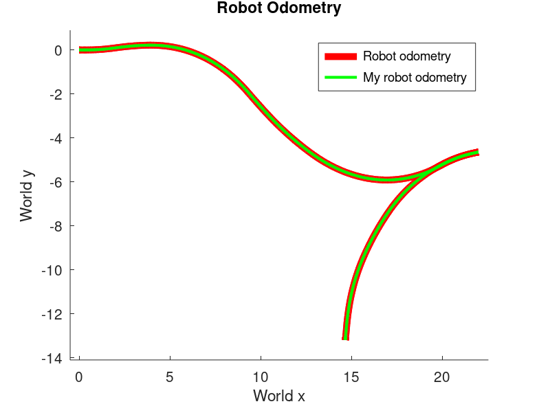

# Calibration of a (real) Robot

## Task Overview

The dataset contains data collected from the sensors of a **real mobile robot**. Namely, a **front-tractor tricycle**.

The **output** should be:

### 1. Sensor Position

- **2D position of the sensor** with respect to the **base link**

### 2. Kinematic Parameters

- **`ksteer`**: radians per tick (of the steering encoder)
- **`ktraction`**: meters per tick (of the traction encoder)
- **`steer_offset`**: steering angle corresponding to zero wheel position
- **`base_line`**: length of the baseline. **Remember that the kinematic center is in the middle of the axis of the rear wheels**

---

## Dataset File

### `dataset.txt`

The first 10 lines contain:

- **Kinematic model**: traction_drive_wheel (front-tractor tricycle)
- **Kinematic parameters to be estimated**
- **Initial guesses** for the parameters
- **Encoder order** 
- **Encoder maximum ranges**
- **Laser w.r.t. base link transform** 

> [!IMPORTANT]
>
> The encoder order and ranges are critical for correctly interpreting the encoder tick data.

---

## Data Record Structure

Each record in the dataset is composed of the following fields:

### 1. Time

- **`time`**: Timestamp of the measurement

### 2. Encoder Ticks

- **`ticks`**: Encoder readings
    - **Steering encoder**: absolute encoder
    - **Traction encoder**: incremental encoder

### 3. Model Pose

- **`model pose`**: Odometry computed using the kinematic model

> [!NOTE]
>
> This model **does not correspond** to the one used in AMR.
>
> You are free to define and use your own kinematic model for this task. Use this for validating your choice.

### 4. Tracker Pose

- **`tracker pose`**: Position of the sensor obtained from an external odometry/tracking system

---

## Encoder Data Notes

> [!WARNING]
>
> Encoder readings are stored as **`uint32`** values, so **overflow may occur** in some cases.

> [!TIP]
>
> Detect and avoid overflow cases.
>
> Use **incremental differences** between encoder readings when integrating the kinematic model.

---

## Methodology

### State

* Qualify the domain

$$
\boldsymbol{x}_r = \begin{pmatrix} k_s \\ k_t \\ so \\ b \end{pmatrix} \in \mathbb{R}^4, \quad
{^rX}_s = \begin{pmatrix} {^rR}_s|{^rt}_s \end{pmatrix} \in SE(2)
$$

Therefore:

$$
X = \{ \boldsymbol{x}_r, {^rX}_s \} \in \mathbb{R}^4 \times SE(2)
$$

* Define an Euclidean parametrization for the perturbation

$$
\Delta x = \begin{pmatrix} \Delta x_r  \\ \Delta x_s \end{pmatrix} \in \mathbb{R}^7
$$

Where:

$$
\Delta x_r = \begin{pmatrix}
\Delta k_s \\ \Delta k_t \\ \Delta so \\ \Delta b
\end{pmatrix} \in \mathbb{R}^4
$$

$$
\Delta {^rx}_s = \begin{pmatrix}
\Delta ^rx_s \\ \Delta ^ry_s \\ \Delta ^r\theta_s
\end{pmatrix} \in \mathbb{R}^3
$$

* Define $\boxplus$ operator

$$
\mathbf{x}_r' = \mathbf{x}_r + \Delta x_r \rightarrow{} \text{No } \boxplus \text{ because Euclidean}
$$

$$
{}^{r}X'_s = {}^{r}X_s \boxplus \Delta {}^{r}x_s = \text{v2t}(\Delta {}^{r}x_s) \cdot {}^{r}X_s
$$

### Controls

- Domain 

  $$
  \mathbf{u} = \begin{pmatrix} t_s \\ t_t \end{pmatrix} \in \mathbb{R}^2
  $$

Where: 

- **Absolute encoder** $\rightarrow$ Steering ticks: $t_s$
- **Incremental encoder** $\rightarrow$ Traction ticks: $t_t$

### Measurements

* Qualify the domain

An external system provide the pose of the sensor in the world, namely

$$
{^w}Z_s = \begin{pmatrix} {^wR}_s | {^wt}_s\end{pmatrix} \in SE(2)
$$

However, out of these we will compute the relative motion of the sensor between pose $s$ and $s$' . Therefore:

$$
^{s}Z_{s'} = \begin{pmatrix} {^sR}_{s'} | {^st}_{s'}\end{pmatrix} \in SE(2)
$$

* Define an Euclidean parametrization for the perturbation

$$
\Delta {^sz}_{s'} = \begin{pmatrix} \Delta ^sx_{s'} \\ \Delta^sy_{s'} \\ \Delta {^s}\theta_{s'} \end{pmatrix} \in \mathbb{R}^3
$$

* Define $\boxminus$ operator

$$
\Delta {^{s}z}_{s'}= {^{s}\bar{Z}}_{s'} \boxminus {^{s}Z}_{s'}=\text{t2v}\left[\left( {^{s}Z}_{s'} \right)^{-1} \cdot {^{s}\bar{Z}}_{s'}\right]
$$

* Identify prediction function

$$
h^{[s,s']}(X) = {^sX}_r \cdot \text{v2t}\left(\Delta ^rx_{r'}\right) \cdot {^{r'}X}_{s'} = {^sX}_{s'}
$$

Where $\Delta ^rx_{r'}$  is the robot relative increment  by the odometry function.

**Note:**   ${^rX}_s$  and ${^{r'}X}_{s'}$ represent the same relative pose, but the latter expresses the sensor relative pose in the new frame after the robot moved. 

* Define the error function

$$
e^{[s,s']}(X) = \text{h}^{[s,s']}(X) \boxminus {^{s}Z}_{s'} = \text{t2v}\left [ \left({^{s}Z}_{s'} \right)^{-1} \cdot {^sX}_{s'} \right]
$$

### Bicycle model 

The front-tractor tricycle model is equivalent to the front-wheel drive bicycle one. Hence:

$$
\begin{aligned}
\Delta x &= \cos(\theta)\cos(\phi)\, ds \\
\Delta y &= \sin(\theta)\cos(\phi) \\
\Delta \theta &= \frac{\sin(\phi)}{l}\, ds
\end{aligned}
$$

Where

$$
\phi = k_s \cdot \text{normalizeAngle}\left( \frac{2\pi t_s}{\text{max}_s} \right) + \delta_s
$$

$$
ds = k_t \cdot \frac{t_t}{\text{max}_t}
$$

Since we are providing relative increments, $\theta = 0$. Therefore, we can further simplifu the model as follows:

$$
\begin{aligned}
\Delta x &= \cos(\phi)\, ds \\
\Delta y &= 0 \\
\Delta \theta &= \frac{\sin(\phi)}{l}\, ds
\end{aligned}
$$

To validate our choice, we can compare the model pose in the dataset and the one resulting from our model

*Figure 1: Comparison of given robot odometry (red) against bicycle model  (green).*

As we can see, the overlap almost perfectly.